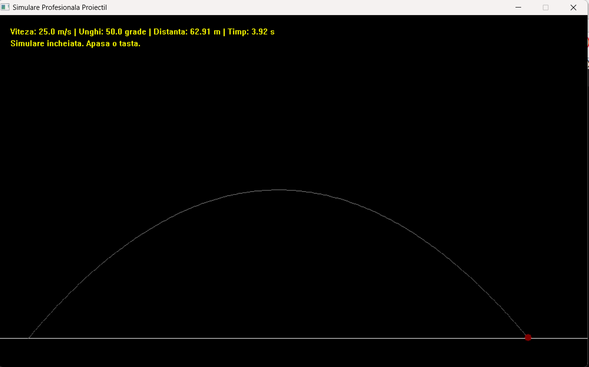

# 2D Projectile Motion Simulator (C++ & WinBGIm)

A real-time, physics-based simulation of oblique projectile motion developed in C++ using the Graphics.h (WinBGIm) library. The application calculates trajectory coordinates based on user input (launch angle and initial velocity) and features an adaptive zoom system to ensure the trajectory always fits the screen regardless of scale.



## 🚀 Features
* **Real-Time Animation:** Simulates movement based on real-world time steps.
* **Adaptive Scaling:** Automatically calculates the best zoom factor so both small-scale (5 m/s) and large-scale (100 m/s) launches are fully visible.
* **Trajectory Tracking:** Leaves a dotted trail to visualize the parabolic path.
* **Live Statistics:** Displays final horizontal range, flight time, and launch parameters.
* **Flicker-Free Rendering:** Utilizes double-buffering (`setactivepage` / `setvisualpage`) for smooth animation.

## 📐 The Physics Behind It
The simulator uses standard kinematic equations for projectile motion, decomposing the velocity vector into horizontal ($x$) and vertical ($y$) components:

### 1. Position Equations
$$x(t) = v_0 \cdot \cos(\alpha) \cdot t$$
$$y(t) = v_0 \cdot \sin(\alpha) \cdot t - \frac{1}{2}g \cdot t^2$$

Where:
* $v_0$: Initial velocity (m/s)
* $\alpha$: Launch angle (radians)
* $g$: Acceleration due to gravity ($9.81 \, m/s^2$)
* $t$: Time elapsed (s)

### 2. Derived Parameters for Scaling
To frame the shot, the program pre-calculates the theoretical maximums:
* **Max Horizontal Range ($R$):** $\frac{v_0^2 \cdot \sin(2\alpha)}{g}$
* **Max Vertical Height ($H$):** $\frac{(v_0 \cdot \sin(\alpha))^2}{2g}$


## 🛠️ Installation & Setup (Code::Blocks 25.03)

Setting up `graphics.h` on modern 64-bit systems can be tricky. Follow these settings based on my configuration:

1.  **Search Directories:** * Add `...\MinGW\include` to the **Compiler** tab.
    * Add `...\MinGW\lib` to the **Linker** tab.
2.  **Linker Settings:**
    * Add the following to **Other Linker Options**:
        ```text
        -lbgi -lgdi32 -lcomdlg32 -luuid -loleaut32 -lole32
        ```
    * Ensure your `libbgi.a` file is a 64-bit compatible version if using a 64-bit compiler.

## 💻 How the Code Works
1.  **Adaptive Zoom:** The code compares the theoretical Range and Height against the window dimensions (1000x600) to find a `zoom` factor that prevents the object from "disappearing" off-screen.
2.  **The Loop:** A `while` loop increments time ($t$). In each iteration, it calculates new coordinates, adds them to a `std::vector` of points, and redraws the entire frame.
3.  **Double Buffering:** By drawing to a hidden "active page" and then flipping it to the "visual page," we avoid the flickering common in basic graphics programming.
